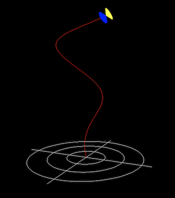

# Gödel's Universe

You can experience the universe by visiting [godeluniverse.surge.sh](http://godeluniverse.surge.sh)

  

## Description
An in-browser 3D model of Kurt Gödel's famous model of the universe which supports time travel with closed timelike curves.

## Tech

* [threejs.org](http://threejs.org) - in-browser, 3D modeling Javascript library
  * Having a 3D representation of this universe is essential to understanding the core concepts. Producing this model in browser makes it significantly more accessible for students, researchers, and general learners to experience Gödel's unvierse. 
* HTML/CSS - inserting information sections and styling
  * It's not only important to represent the universe but also provide information about what is happening in the browser.

## Acknowledgements
I would like to thank [Professor James Binkoski](http://www.binkoski.net/) who teaches Philosophy at Dartmouth College for the endless support and guidance through the project.
